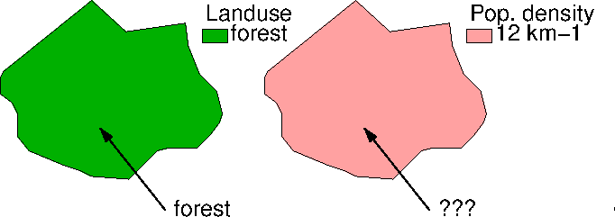

```{r setup, include=FALSE}
knitr::opts_chunk$set(echo = TRUE)
```

## Part I (90')

* A. Spatial data, simple features (20' + 10' exercises)
* B. Temporal data, raster data (20' + 10' exercises)
* C. Raster/vector data cubes, large rasters (20' + 10' exercises)

## A. Spatial data and simple features

Since data collections can only be done _somewhere_, and at _some
time_, all data is, in principle spatial and temporal. In many cases
location are implicit, and for instance encoded as ID of an object.
In other cases, locations are encoded with _coordinates_.

Coordinates can be three-dimensional $(x, y, z)$, but are in many
cases two-dimensional $(x, y)$. For _geo_ spatial data, that is,
data that are Earth-bound, two-dimensional coordinates are either 

* [geographic](https://en.wikipedia.org/wiki/Geographic_coordinate_system):
angles (degrees longitude and latitude), pointing out locations on an
[ellipsoid](https://en.wikipedia.org/wiki/Earth_ellipsoid) or sphere
* projected: measured in a two-dimensional flat
space, e.g. in metres, related to an ellipsoid by
[_projection_](https://en.wikipedia.org/wiki/Map_projection)

A **coordinate reference sytem** (CRS) describes how coordinates
are to be interpreted: which location on Earth do they refer to. In
case of projected coordinates the CRS contains the projection type
and parameters, in all cases which reference ellipsoid the original
geographic coordinates are associated with (e.g., WGS84, or NAD27).

### Objects and fields, features

It makes in many cases sense to distinguish to "types" of spatial
information, depending on whether variation is discrete or continuous
_over space_:

* **objects** are discrete things: houses, cars, rivers, persons, which have a location and other properties
* **fields** are continuous phenomena: temperature and pressure of air, elevation of the Earth surface; fields are essentially _functions_ mapping from two- or three-dimensional space (and possibly time) to a value.

[OGC](https://www.opengeospatial.org/), a standardisation
body for geospatial information, defines in its [abstract
specification](http://www.opengeospatial.org/docs/as) a
[feature](https://www.opengeospatial.org/standards/sfa) as an
"abstraction of real world phenomena" that has a geometry and
attributes (other characteristics). Abstractions of both objects
and fields are considered **features**.

**Simple features** are features with all geometric attributes
described piecewise by straight line or planar interpolation between
sets of points [@sfa]; simple feature geometries are of type

* `point`, `multipoint`, 
* `linestring`, `multilinestring`, 
* `polygon`, `multipolygon`, or
* combinations of these (`geometrycollection`).

**Coverages** is the term OGC uses to represent field variables; the
are typically (but not necessarily) associated with raster data.

### Support

In the following figure:

```{r echo=FALSE}

```

what is the value at the point location pointed to with the arrow?

* For _land use_, we have an infinite set of point observations;
for every point in the polygon we know the land use; although this
would maybe be only one _record_ in our tables, this is a field
variable (or "coverage") representing a large set of points.
* for _population density_ we have a single observation, which is
an aggregation for the entire polygon (the sum of the inhabitants,
divided by the polygon area). This is a feature attribute.

**Support** is the physical size (length, area, volume) a single
quantity, or measurement, is associated with. For the land use
variable, we have _point support_. For the population density
variable we have support the _size of the area aggreated over_.

### intro to `sf`

Although not needed for working with `sf`, we'll be using tidyverse.
```{r}
library(tidyverse) # although not needed for working with sf!
```
`sf` uses the OSGEO stack of software:
```{r}
library(sf)
```
Internal (R) and system dependencies look like this:
```{r echo=FALSE}
knitr::include_graphics('sf_deps.png')
```

Package `sf` provides handling of feature data, where feature
geometries are points, lines, polygons or combinations of those.
It implements the full set of geometric functions described in the
_simple feature access_ standard, and some. The basic storage is
very simple, and uses only base R types (list, matrix).

* feature sets are held as records (rows) in `sf` objects, inheriting from `data.frame` or `tbl_df`
* `sf` objects have at least one simple feature geometry list-column of class `sfc`
* `sfc` geometry list-columns have a bounding box and a coordinate reference system as attribute, and a class attribute pointing out the common type (or `GEOMETRY` in case of a mix)
* a single simple feature geometry is of class `sfg`, and further classes pointing out dimension and type

Storage of simple feature geometry:

* `POINT` is a numeric vector
* `LINESTRING` and `MULTIPOINT` are numeric matrix, points/vertices in rows
* `POLYGON` and `MULTILINESTRING` are lists of matrices
* `MULTIPOLYGON` is a lists of those
* `GEOMETRYCOLLECTION` is a list of typed geometries

To build from scratch:
```{r}
p1 = st_point(c(3,5))
class(p1)
p2 = st_point(c(4,6))
p3 = st_point(c(4,4))
pts = st_sfc(p1, p2, p3)
class(pts)
sf = st_sf(a = c(3,2.5,4), b = c(1,2,4), geom = pts)
class(sf)
sf = st_as_sf(tibble::tibble(a = c(3,2.5,4), b = c(1,2,4), geom = pts))
class(sf)
sf
plot(sf, cex = 3, pch = 16, key.pos = 1, breaks = seq(.5,4.5,1), pal = sf.colors(4))
```

We can read some real data:

```{r}
nc = read_sf(system.file("gpkg/nc.gpkg", package="sf")) # read as sf-tibble
agr = c(AREA = "aggregate", PERIMETER = "aggregate", CNTY_ = "identity",
  CNTY_ID = "identity", NAME = "identity", FIPS = "identity", FIPSNO = "identity",
  CRESS_ID = "identity", BIR74 = "aggregate", SID74 = "aggregate", NWBIR74 = "aggregate",
  BIR79 = "aggregate", SID79 = "aggregate", NWBIR79  = "aggregate")
st_agr(nc) = agr 
nc[c(9:11,15)]
```

where `st_agr` specifies the _attribute geometry relationship_,
indicating for each attribute whether we have polygon support
(`aggregate`) or point support (`constant` or `identity`) for
the attributes.

Suppose we want to query the `nc` dataset at `POINT (-78.25073 34.07663)` (so-called _well known text_ encoding of points with these x and y coordinate), then we can do this by

```{r}
pt = st_as_sfc("POINT (-78.25073 34.07663)")
st_intersection(nc, st_sfc(pt, crs = st_crs(nc)))
```

This generates a warning because some of the variables have non-point
support, meaning that probably a meaningless value is now attached
to a point geometry. The warning is not emitted if the attribute variable 
returned has point support, as in

```{r}
i = st_intersection(nc["CNTY_"], st_sfc(pt, crs = st_crs(nc)))
```

The remaining warning is justified, as we are doing 2D flat geometry
on spherical (ellipsoidal), geographical coordinates. This is often
works out, but not always. It goes away when we work with projected
(planar) coordinates, e.g. in

```{r}
nc1 = st_transform(nc, 2264) # NC state plain, US feet
pt1 = st_transform(st_sfc(pt, crs = st_crs(nc)), 2264)
i1 = st_intersection(nc1["CNTY_"], pt1)
```

We can plot two variable, for instance using base plot 

```{r}
plot(nc[c("SID74", "SID79")], key.pos = 4)
```

or `ggplot`:

```{r}
nc %>% select(SID74, SID79) %>% gather(VAR, SID, -geom) -> nc2 # stack two columns
ggplot() + geom_sf(data = nc2, aes(fill = SID)) + facet_wrap(~VAR, ncol = 1) +
  scale_y_continuous(breaks = 34:36) +
  scale_fill_gradientn(colors = sf.colors(12)) 
```

### Exercises

1. start R, install package `sf` if not already present, and load it
2. load the `nc` sample dataset as done above
3. use `st_intersects` to discover which counties in `nc` intersect with county `Rowan`; experiment with the order of arguments to `st_intersects`
4. try to understand the object returned by `st_intersects`
5. look up which methods are available for objects of class `sgbp` (`methods(class = "sgbp")`), and try some of them
6. does `Rowan` intersect with itself? 
7. Find all counties that touch `Rowan` by using `st_touches`; does `Rowan` touch itself?
8. How can we find what `intersects` and `touches` mean, more formally?


## B. Temporal data, raster data (20' + 10' exercises)

### Time in R

Base R has two time classes:
```{r}
(dt = Sys.Date())
class(dt)
(tm = Sys.time())
class(tm)
```
where `Date` has (integer) numbers representing the day number, and
`POSIXct` has (double, decimal) seconds, both counting since Jan 1,
1970, 00:00 UTC. 

### Time series data

Packages `zoo` and `xts` provide classes for working with matrices
of data, with a time index for each row.  The more recent package
`tsibble` does something similar, extending `tibbles` rather than
`matrix`.

We will use a small piece of the `air` dataset in `spacetime`:
```{r}
data(air, package = "spacetime") # requires spacetime to be installed
sel = 1800:2300
library(xts)
a.xts = xts(t(air)[sel,], order.by = dates[sel])
```

`xts` has the ability to intrepret
[ISO-8601](https://en.wikipedia.org/wiki/ISO_8601) strings as time
intervals, 
### time
```{r}
xts::.parseISO8601("2002-03")
```

and they can be used for time selection; we can select the first six
months of 2003 (rows) and the first four stations (columns), using

```{r}
plot(a.xts["2003-01/2003-06",1:4], main = "PM10, four rural background stations, DE")
```

Neither `xts`, nor (to my knowledge) other R packages for time
series data, keep an explicit record of the time _periods_ for which
individual records are valid. The PM10 data examined here e.g. are
daily averages, but a single time stamp (for daily data the start
of the day, by convention) is registered for each observation.

The data considered here form a kind of a space-time raster, as
shown by
```{r}
image(dates[sel], 1:70, as.matrix(a.xts), ylab = "station")
```

### Raster data

Raster data represent a 2-D matrix, where dimensions (rows/cols)
map uniquely into coordinates.

In the simplest case of a 

- **regular raster** 
    - $c(i) = o + (i-1) \times \delta, \ \ i = 1,2,...,n$
    - $o$ is the border or the raster, $\delta$ the cell size
    - for x, $\delta$ is usually positive, for y, negative (and $o$ the top edge)
    - index space is continuous: integer $i$ implies $[i,i+1)$
    - every coordinate value maps to a unique index (unlike polygon coverages, where boundaries are ambiguous)

More complex rasters are

- **rotated raster** 
    - column and row dimensions are not alined with x and y axis

- **sheared raster** 
     - column and row dimensions are no longer perpendicular

- **rectilinear raster** 
     - increments along column and row dimension are not constant

- **curvilinear raster** 
     - every col/row combination has its own x and y value (or corner values)

```{r echo=FALSE}
suppressPackageStartupMessages(library(stars))
suppressPackageStartupMessages(library(ggplot2))
x = 1:5
y = 1:4
d = st_dimensions(x = x, y = y, .raster = c("x", "y"))
m = matrix(runif(20),5,4)
r1 = st_as_stars(r = m, dimensions = d)

r = attr(d, "raster")
r$affine = c(0.2, -0.2)
attr(d, "raster") = r
r2 = st_as_stars(r = m, dimensions = d)

r = attr(d, "raster")
r$affine = c(0.1, -0.3)
attr(d, "raster") = r
r3 = st_as_stars(r = m, dimensions = d)

x = c(1, 2, 3.5, 5, 6)
y = c(1, 1.5, 3, 3.5)
d = st_dimensions(x = x, y = y, .raster = c("x", "y"))
r4 = st_as_stars(r = m, dimensions = d)

grd = st_make_grid(cellsize = c(10,10), offset = c(-130,10), n= c(8,5), crs=st_crs(4326))
r5 = st_transform(grd, "+proj=laea +lon_0=-70 +lat_0=35")

par(mfrow = c(2,3))
r1 = st_make_grid(cellsize = c(1,1), n = c(5,4), offset = c(0,0))
plot(r1, main = "regular")
plot(st_geometry(st_as_sf(r2)), main = "rotated")
plot(st_geometry(st_as_sf(r3)), main = "sheared")
plot(st_geometry(st_as_sf(r4, as_points = FALSE)), main = "rectilinear")
plot(st_geometry((r5)), main = "curvilinear")
```

### Analysing raster data

Package [`raster`](https://rspatial.org/raster/index.html) has
been around for a long time, is robust, well tested, versatile,
and works for large rasters. We will not discuss it here.

The more recent [`stars`](https://r-spatial.github.io/stars/)
package has a different take on raster data, and will be used here.
The following example loads 6 bands from a (section of a) Landsat
7 image, and plots it:
```{r}
library(stars) # will load sf
tif = system.file("tif/L7_ETMs.tif", package = "stars")
x = read_stars(tif)
plot(x)
```
The irregular color breaks come from the default of using "type =
quantile" to `classInt::classIntervals()`, which causes [histogram
stretching](https://en.wikipedia.org/wiki/Histogram_equalization);
this is done over all 6 bands.

### stars: out-of-memory (if time permits)

Copernicus' [Sentinel 2](https://en.wikipedia.org/wiki/Sentinel-2)
provides the state-of-the art multispectral satellite images of
today: 10 m resolution, 5 days intervals. A sample image is provided
in the (off-CRAN) 1 Gb `starsdata` package:

```{r eval=FALSE}
install.packages("starsdata", repos = "https://cran.uni-muenster.de/pebesma" , type = "source")
library(starsdata)
```

```{r}
have_starsdata = require("starsdata") # TRUE to do the big data example with pkg starsdata; instructions for installing below
```

We will read in the four 10-m resolution bands:

```{r eval=have_starsdata}
granule = system.file("sentinel/S2A_MSIL1C_20180220T105051_N0206_R051_T32ULE_20180221T134037.zip", package = "starsdata")
base_name = strsplit(basename(granule), ".zip")[[1]]
s2 = paste0("SENTINEL2_L1C:/vsizip/", granule, "/", base_name, ".SAFE/MTD_MSIL1C.xml:10m:EPSG_32632")
(p = read_stars(s2, proxy = TRUE))
object.size(p)
```

As we can see, this object contains no data, but only a pointer to the data. Plotting it,

```{r eval=have_starsdata}
system.time(plot(p))
```

takes less than a second, because only pixels that can be seen are
read; plotting the full 10000 x 10000 images would have taken more
than 10 minutes.

We can compute an index like [ndvi](https://en.wikipedia.org/wiki/Normalized_difference_vegetation_index), and plot it:

```{r eval=have_starsdata}
ndvi = function(x) (x[4] - x[1])/(x[4] + x[1])
rm(x)
(s2.ndvi = st_apply(p, c("x", "y"), ndvi))
system.time(plot(s2.ndvi)) # read - compute ndvi - plot
```

where lazy evaluation is used: `s2.ndvi` still contains no pixels,
but only `plot` calls for them, and instructs `st_apply` to only
work on the resolution called for. If we would save `s2.ndvi` to
disk, the full resolution would be computed: the command

```{r eval=FALSE}
write_stars(s2.ndvi, "s2.tif")
```
takes 5 minutes and writes a 500 Mb GeoTIFF.

### Exercises

1. Start R, install package `stars` (if not already present), and load it
2. load the Landsat image test set, as above
3. Create an RGB composite plot using argument `rgb = c(3,2,1)` for RGB, and `rgb = c(4,3,2)` for false color.
4. Use `x6 = split(x, "band")` to create a 2-dimensional raster with 6 attributes
5. Plot `x6`. What has changed?
6. Compute the mean of all six bands by adding all six attributes and dividing by 6, and assigning the resulting matrix as a new attribute in `x6`
7. As an alternative, compute the mean of all six bands by applying function `mean` over the `x` and `y` dimensions (essentially reducing "band"), by using `st_apply`; compare the results of the two approaches

## C. Raster/vector data cubes, large rasters (20' + 10' exercises)

This section tries to bring everything together: simple features,
vector data, time series, and rasters.

### spatial time series

We will create a stars object from the space/time matrix in `air`:

```{r}
a = air[,sel]
dim(a)
library(units)
(a.st = st_as_stars(list(PM10 = set_units(air[,sel], ppm))))
```
however, this has still no knowledge of space and time dimensions, and reference systems. We can add this:

```{r}
crs = 32632 # UTM zone 32N
a.st %>% 
  st_set_dimensions(1, values = st_as_sfc(stations)) %>% 
  st_set_dimensions(2, values = dates[sel]) %>% 
  st_transform(crs) -> a.st2
a.st2
st_bbox(a.st2)
st_crs(a.st2)
```

### vector and raster data cubes: what are they?

- They are annotated **array data**.
- Arrays map from $n$ dimensions to $p$ attributes:
$$(D_1,D_2,...,D_n)\rightarrow (A_1,A_2,...,A_p)$$
- array dimensions are enumerated sets, and may
    - represent a set of entities (cities, persons, species, spectral bands)
    - discretize a continuous variable, such as 
        - spatial _dimension_, 
        - time, 
        - time-of-day, 
        - frequency or wavelength, 
        - duration (e.g., time-to-forecast)

### "Cube": 

We use the word _cube_ short for

- "real" cube: three dimensions
- more than three dimensions: hypercube
- two dimensions: matrix, raster

a special case is:

- one dimensional cube: table with records (`data.frame`, `tibble`)

### "Spatial" data cube

Cube dimensions can refer to spatial dimensions in several ways:

- each continuous spatial dimension (x, y, z) maps to a **single** cube dimension (**raster** data cubes), e.g. regular grids
   - $c(i) = o + (i-1) \times \delta, \ \ i = 1,2,...,n$
   - index space is continuous: integer $i$ implies $[i,i+1)$
   - this means that every coordinate value maps to a unique index (unlike polygons)

- **all** spatial dimensions map to a single cube dimension (**vector** data cubes)
    - cube dimension is a set of points/lines/polygons
    
- combinations of these: e.g. origin-destination matrices

----

```{r,out.width='100%'}
knitr::include_graphics('cube1.png')
```

----

```{r,out.width='100%'}
knitr::include_graphics('cube2.png')
```

----

```{r,out.width='100%'}
knitr::include_graphics('cube3.png')
```

----

```{r,out.width='100%'}
knitr::include_graphics('cube4.png')
```

### geostatistics with sf and stars (10')

For the following to run well, we need `stars` (>= 0.3-2) installed from github:
```{r eval=FALSE}
remotes::install_github("r-spatial/stars")
```

We can interpolate these spatial time series, when we have a target grid, e.g.
created by

```{r}
DE_NUTS1 %>% st_as_sfc() %>% st_transform(crs) -> de # DE_NUTS1 is part of the "air" datasets
grd = st_as_stars(de)
grd[[1]][grd[[1]] == 0] = NA
plot(grd, axes = TRUE)
```

We will work with temporal means, rather than full space/time variability, and fit
a variogram to the temporal mean PM10 values:
```{r}
library(gstat)
st_apply(a.st2, "sfc", mean, na.rm = TRUE) %>% 
	st_as_sf() %>%
	na.omit()  -> a.means
v = variogram(mean ~ 1, a.means)
v.fit = fit.variogram(v, vgm(10, "Exp", 1e5, 10))
plot(v, v.fit)
```

Then, we can use this for kriging:
```{r}
int <- krige(mean~1, a.means, grd, v.fit)
plot(int, reset = FALSE, key.pos = 4, breaks = "pretty")
plot(de, col = NA, border = 'red', add = TRUE)
plot(st_geometry(a.means), col = 'green', add = TRUE, pch = 16)
```

A `ggplot2` plot of the same is obtained by
```{r}
library(viridis)
g = ggplot() + coord_equal() +
    scale_fill_viridis() +
    theme_void() +
    scale_x_discrete(expand=c(0,0)) +
    scale_y_discrete(expand=c(0,0))
g + geom_stars(data = int) + geom_sf(data = de, fill = NA) + geom_sf(data = a.means)
```

It is likely that `geom_stars()` will be developed further, to take
some of the defaults now being set for creating object `g`.

A further worked out space/time case study on this type of data is
found in the geostatistics/interpolation chapter of [@sdsr].

### time series rasters

```{r eval=have_starsdata}
x = c(
"avhrr-only-v2.19810901.nc",
"avhrr-only-v2.19810902.nc",
"avhrr-only-v2.19810903.nc",
"avhrr-only-v2.19810904.nc",
"avhrr-only-v2.19810905.nc",
"avhrr-only-v2.19810906.nc",
"avhrr-only-v2.19810907.nc",
"avhrr-only-v2.19810908.nc",
"avhrr-only-v2.19810909.nc"
)
# see the second vignette:
# install.packages("starsdata", repos = "http://pebesma.staff.ifgi.de", type = "source")
file_list = system.file(paste0("netcdf/", x), package = "starsdata")
(y = read_stars(file_list, quiet = TRUE))
library(abind)
z <- y %>% select(sst) %>% adrop()
# g + geom_stars(data = z[1], alpha = 0.8) + facet_wrap("time")
z$sst = units::drop_units(z$sst) # otherwise, titles are messed up (issue)
plot(z)
```

### Transforming rasters

With such a grid, and any other grid, `st_transform` simply creates
a new curvilinear grid:

We can _warp_ a **regular** grid to be a new **regular** grid in the
existing, or to a default grid in a new target CRS, e.g. by

```{r}
tif = system.file("tif/L7_ETMs.tif", package = "stars")
read_stars(tif) %>%
  slice(prec, index = 1, along = "band") %>%
  st_warp(crs = "+proj=lcc") %>%
  plot()
```

As an option, it can use `gdalwarp`, using its library interface
(see `sf::gdal_utils`).

### Curvilinear grids

Consider the following, curvilinear, grid:
```{r}
prec_file = system.file("nc/test_stageiv_xyt.nc", package = "stars")
(prec = read_ncdf(prec_file, curvilinear = c("lon", "lat")))
## plot(prec) ## gives error about unique breaks:
## remove NAs, zeros, and give a large number
## of breaks (used for validating in detail)
qu_0_omit = function(x, ..., n = 22) {
  x = na.omit(x)
  c(0, quantile(x[x > 0], seq(0, 1, length.out = n)))
}
library(dplyr) # loads slice generic
prec_slice = slice(prec, index = 17, along = "time")
breaks = qu_0_omit(prec_slice[[1]])
plot(prec_slice, border = NA, breaks = breaks, reset = FALSE)
nc = sf::read_sf(system.file("gpkg/nc.gpkg", package = "sf"), "nc.gpkg")
plot(st_geometry(nc), add = TRUE, reset = FALSE, col = NA, border = 'red')
```

Essentially, such grids are plotted as simple features (small
polygons) by extrapolating grid cell centeres. This will not (yet)
work with grid crossing dateline or poles.

### Exercises

For the exercises, it may be good to use a version of `stars` not yet on CRAN, installed by:
```{r eval=FALSE}
remotes::install_github("r-spatial/stars")
```

1. rasterize the `nc` dataset above, using `st_rasterize`. Which attribute is retained? How could you do this for another attribute?
2. Modify the rasterization such that you get 30 rows and 60 columns (hint: look at the exercises help of `?st_rasterize`)
3. Look up what `st_crop` does, and run its examples.
4. Using the precipitation grid data shown above, find the time series with for each county in North Carolina the _maximum_ precipitation, and plot this. Note that
    - `nc` has a different datum from `prec`, use `st_transform` for datum transformation
	- the time values should be hourly, but may come out differently
5. read in the file `system.file("nc/tos_O1_2001-2002.nc", package = "stars")`
6. what is the bounding box of this data set? What is the CRS, and the temporal reference system?
7. obtain the temperature time series of this dataset at point `POINT(200 10)`, using `pt = st_sfc(st_point(c(200, 10)))`

## References
